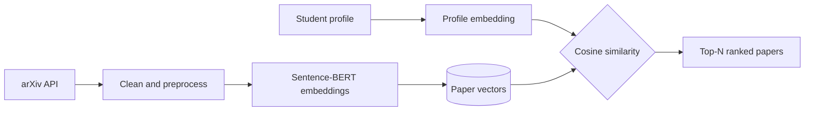

# ResearchMatch

**AI-powered research paper recommendations for students.**

Tell it your skills, interests and career goal, and it returns a ranked list of research papers that fit your profile, with a match score for each.


---

## Why this exists

Choosing a research area or project topic is hard when there are thousands of papers and no idea where to start. ResearchMatch narrows that down by matching a student's own profile against paper abstracts, so the first page of results is already relevant.

## Features

- **Personalized recommendations** ranked by semantic similarity, not keyword matching
- **Match score** on every paper so you can see how close the fit is
- **Secure accounts** with JWT authentication and bcrypt-hashed passwords
- **Editable profile**: update skills and interests any time and get fresh results
- **Bookmarking**: save papers and come back to them later
- **Protected routes**: private pages are only reachable when logged in

## How it works



1. About 250 paper abstracts were collected from arXiv across five areas: machine learning, NLP, computer vision, web development and cybersecurity.
2. Titles and abstracts are cleaned and combined into one text field per paper.
3. Every paper is converted to a 384-dimension vector using the pretrained `all-MiniLM-L6-v2` model.
4. When a student submits a profile, the same model embeds it in real time.
5. Cosine similarity between the profile vector and all paper vectors gives the match score. The highest scores are returned.

No model is fine-tuned. Using a pretrained embedding model with similarity search keeps the results explainable and easy to verify.

## Tech stack

| Layer | Tools |
|---|---|
| Frontend | React (Vite), Tailwind CSS, React Router, lucide-react |
| Backend | FastAPI, SQLAlchemy, SQLite |
| Auth | JWT, bcrypt via passlib |
| ML / NLP | sentence-transformers, scikit-learn, pandas |
| Data source | arXiv API |

## Project structure

```
ai-research-recommender/
├── backend/
│   ├── data/                    papers, sample students, embeddings
│   ├── fetch_papers.py          pulls papers from arXiv
│   ├── create_students.py       builds sample student profiles
│   ├── preprocess.py            cleans text
│   ├── generate_embeddings.py   creates and saves embeddings
│   ├── recommend.py             similarity search
│   ├── auth.py                  password hashing and JWT
│   ├── database.py              User model and DB session
│   └── main.py                  FastAPI routes
└── frontend/
    └── src/
        ├── pages/               Home, Login, Signup, ProfileSetup,
        │                        Dashboard, Recommendations, Saved
        └── components/          ProtectedRoute
```

## Getting started

Requirements: Python 3.11+ and Node.js 18+.

### 1. Backend

```bash
python -m venv venv
venv\Scripts\activate          # Windows
# source venv/bin/activate     # macOS / Linux

pip install fastapi uvicorn sqlalchemy passlib bcrypt==4.0.1 python-jose python-multipart
pip install sentence-transformers pandas scikit-learn requests

cd backend
python fetch_papers.py
python create_students.py
python preprocess.py
python generate_embeddings.py
uvicorn main:app --reload
```

API: `http://127.0.0.1:8000` &nbsp;|&nbsp; Interactive docs: `http://127.0.0.1:8000/docs`

### 2. Frontend

```bash
cd frontend
npm install
npm run dev
```

App: `http://localhost:5173`

## API reference

| Method | Endpoint | Description |
|---|---|---|
| POST | `/auth/signup` | Create an account, returns a JWT |
| POST | `/auth/login` | Log in, returns a JWT |
| POST | `/recommend-live` | Recommendations for a submitted profile |
| GET | `/recommend/{student_id}` | Recommendations for a sample student |

Example request:

```json
POST /recommend-live
{
  "skills": "Python, Deep Learning",
  "interests": "Computer Vision, Image Processing",
  "career_goal": "Research"
}
```

## Known limitations

- The dataset is small (about 250 papers), so results are limited to the five topic areas above.
- Profile data and saved papers live in the browser's local storage, not the database, so they do not follow the user across devices.
- Match scores are raw cosine similarity and have not yet been evaluated against labelled data.

## Roadmap

- [ ] Store profiles and saved papers in the database
- [ ] Hybrid scoring: similarity combined with skill overlap and paper recency
- [ ] Larger dataset covering more fields
- [ ] Evaluation on real student profiles
- [ ] Deployment

## Author

Built by [hitanshiupadhyay16-eng](https://github.com/hitanshiupadhyay16-eng)
